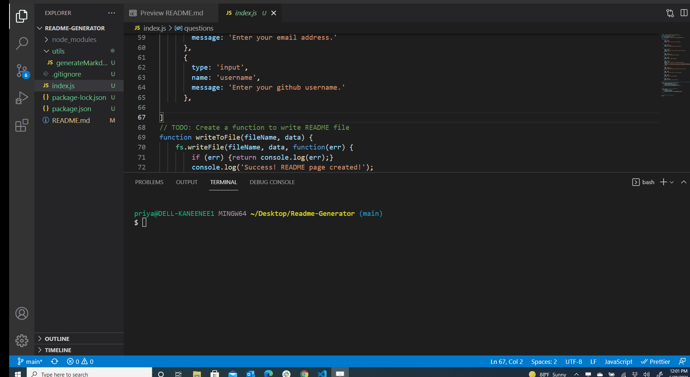

  # A README GENERATOR 
  # Description
  Creating a readme homework project towards my bootcamp with an array of question and answers
   
  ## Table of Contents
  * [Installation](#installation)
  * [Usage](#usage)
  * [License](#license)
  * [Contributors](#contributors)
  * [Tests](#tests)
  * [Questions](#questions)
  
  ## Visuals
  
  
  ## Installation
  Used npm and inquirer
  ## Usage
  Ran node index
  ## License 
  APACHE 2.0 
  ## Contributors
  Single contributor at this time
  ## Tests 
  Ran node index and answered questions  
  ## Questions
  Contact: blank@gmail.com
  Github Username: https://github.com/BLANKUSER 
  
  
